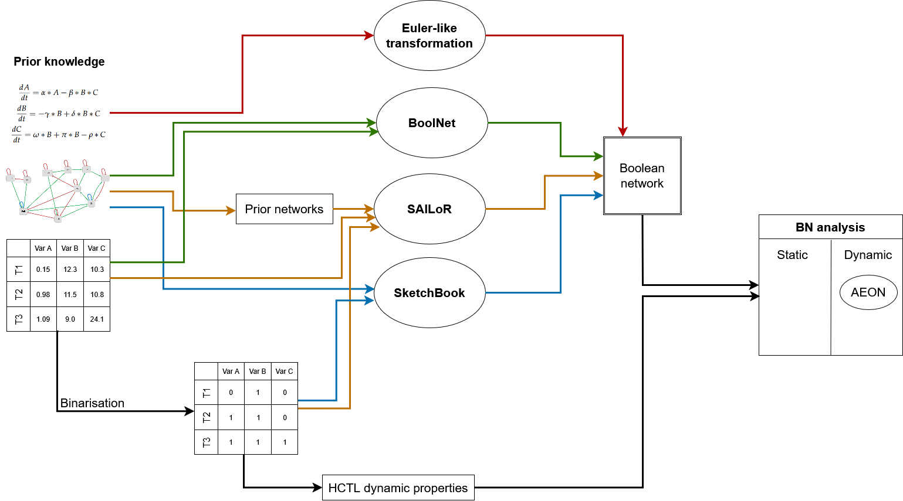

# Reconstructing Boolean Network Models of Systems with Complex Oscillatory Dynamics

This repository contains the implementation, data, and documentation associated with my master's thesis at the [Faculty of Informatics, Masaryk University](https://www.fi.muni.cz/), Brno.

## Thesis Description

**Title**: *Reconstructing Boolean Network Models of Systems with Complex Oscillatory Dynamics*

**Author**: Oto Stanko  
**Institution**: Faculty of Informatics, Masaryk University  
**Program**: Master's Degree in Artificial intelligence and data processing, Bioinformatics and systems biology

The general topic of the thesis is the reconstruction and analysis of Boolean Networks (BNs) that reflect complex oscillatory patterns in biological systems.

## Objectives

1. **Understand Oscillatory Biological Systems**  
   Explore the oscillatory behavior of several biologically relevant systems.

2. **Design an Inference Workflow**  
   Develop a comprehensive pipeline to reconstruct Boolean Network models from:
   - Existing ODE-based differential models
   - Available experimental data
   - Formalized hypotheses about system behavior

3. **Evaluate on Case Studies**  
   Apply the workflow to biologically meaningful systems:
   - Predator-prey system
   - Bovine estrous cycle
   - Human menstrual cycle

5. **Analysis and Discussion**  
   Discuss the benefits, limitations, and potential extensions of the proposed approach

## Workflow Overview

The figure below illustrates the complete inference pipeline combining ODE models, experimental data, and formal dynamic properties:

